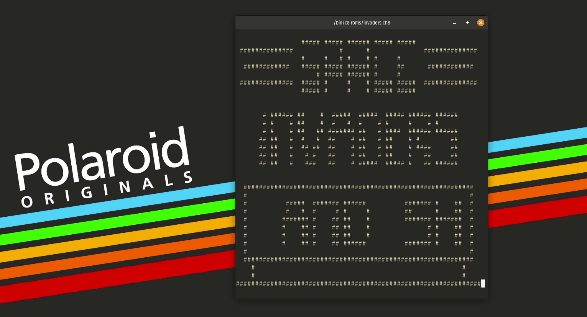

# C8

C8 is a minimal Chip8 emulator written in C99. It's specification was based off of [this pdf](http://www.cs.columbia.edu/~sedwards/classes/2016/4840-spring/designs/Chip8.pdf). The emulator was written in a day and tries to be as close to the specification as possible. The actual emulator is located in 2 files (`src/chip.h` & `src/chip.c`) and is designed to be modular in design and can easily be reused in another project with minor modifications.



## Compiling

Simply run `make` to compile using the CLang compiler.

```
make clean && make
```

or you can use a different C compiler by specifying CC, eg. to use the GNU C compiler

```
make CC=gcc
```

the output binary will be located at `bin/c8`

## Usage

Pass the rom as the only argument to the binary, eg. to run the maze rom do

```
./bin/c8 roms/maze.ch8
```

The controls are mapped to the keyboard, here is a side by side for comparison

```
Chip-8:
╔═══╦═══╦═══╦═══╗
║ 1 ║ 2 ║ 3 ║ C ║
╠═══╬═══╬═══╬═══╣
║ 4 ║ 5 ║ 6 ║ D ║
╠═══╬═══╬═══╬═══╣
║ 7 ║ 8 ║ 9 ║ E ║
╠═══╬═══╬═══╬═══╣
║ A ║ 0 ║ B ║ F ║
╚═══╩═══╩═══╩═══╝

Keyboard:
╔═══╦═══╦═══╦═══╗
║ 1 ║ 2 ║ 3 ║ 4 ║
╠═══╬═══╬═══╬═══╣
║ Q ║ W ║ E ║ R ║
╠═══╬═══╬═══╬═══╣
║ A ║ S ║ D ║ F ║
╠═══╬═══╬═══╬═══╣
║ Z ║ X ║ C ║ V ║
╚═══╩═══╩═══╩═══╝
```